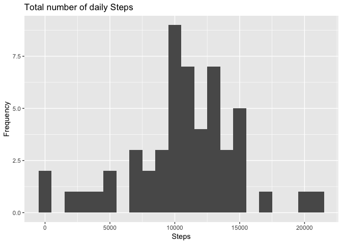
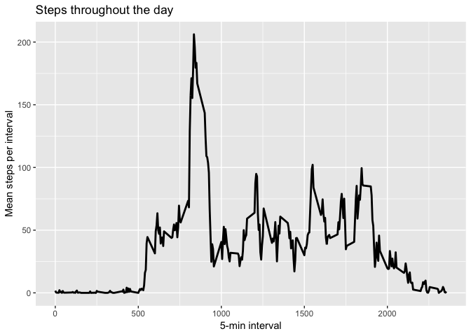
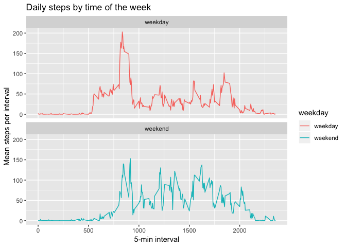
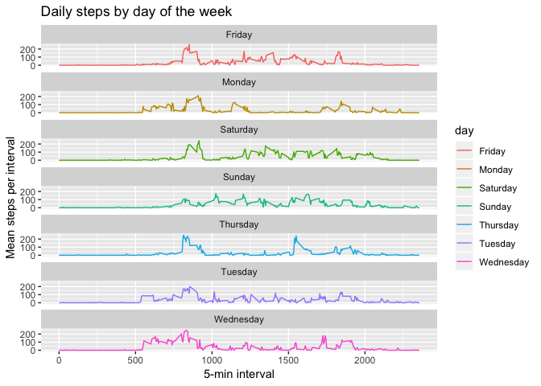

## For reference

The dataset is stored in a zipped CSV file with a total of 17,568 observations.  
Original dataset: [Activity monitoring data](https://d396qusza40orc.cloudfront.net/repdata%2Fdata%2Factivity.zip)

Included variables:  

* steps: Number of steps taking in a 5-minute interval (missing values are coded as NA)
* date: The date on which the measurement was taken in YYYY-MM-DD format
* interval: Identifier for the 5-minute interval in which measurement was taken


## Loading and preprocessing the data

1. Load the data (i.e. `read.csv()`)


```r
# Setup
library("data.table")
library(ggplot2)

# String variables for file download
fileName <- "activity.zip"
fileUrl <- "https://d396qusza40orc.cloudfront.net/repdata%2Fdata%2Factivity.zip"
dir <- "data"

# Check if zip file has been downloaded
if(!file.exists(fileName)){
  download.file(fileUrl, destfile = paste0(getwd(), '/activity.zip'), method = "curl")
}

# Check is csv exists.
if(!file.exists(dir)){
	unzip(fileName,exdir = "data")
}
```

2. Process/transform the data (if necessary) into a format suitable for your analysis


```r
# Read into Data.Table
activityDT <- data.table::fread(input = "data/activity.csv")
```


## What is mean total number of steps taken per day?

1. Make a histogram of the total number of steps taken each day


```r
# Total steps per day
Total_Steps <- activityDT[, c(lapply(.SD, sum, na.rm = FALSE)), .SDcols = c("steps"), by = .(date)] 

ggplot(Total_Steps, aes(x = steps)) +
  geom_histogram(, binwidth = 1000) +
  labs(title = "Total number of daily Steps", x = "Steps", y = "Frequency")
```

```
## Warning: Removed 8 rows containing non-finite values (stat_bin).
```

<!-- -->

2. Calculate and report the **mean** and **median** total number of steps taken per day


```r
Total_NA <- Total_Steps[, .(Mean_Steps = mean(steps, na.rm = TRUE), Median_Steps = median(steps, na.rm = TRUE))]
Total_NA
```

```
##    Mean_Steps Median_Steps
## 1:   10766.19        10765
```


## What is the average daily activity pattern?

1. Make a time series plot (i.e. `type = "l"`) of the 5-minute interval (x-axis) and the average number of steps taken, averaged across all days (y-axis)


```r
IntervalDT <- activityDT[, c(lapply(.SD, mean, na.rm = TRUE)), .SDcols = c("steps"), by = .(interval)] 

ggplot(IntervalDT, aes(x = interval , y = steps)) + 
  geom_line(size=1) +
  labs(title = "Steps throughout the day", x = "5-min interval", y = "Mean steps per interval")
```

<!-- -->

2. Which 5-minute interval, on average across all the days in the dataset, contains the maximum number of steps?


```r
IntervalDT[steps == max(steps), .(max_interval = interval)]
```

```
##    max_interval
## 1:          835
```


## Imputing missing values

1. Calculate and report the total number of missing values in the dataset (i.e. the total number of rows with `NA`s)


```r
activityDT[is.na(steps), .N ]
```

```
## [1] 2304
```

2. Devise a strategy for filling in all of the missing values in the dataset. The strategy does not need to be sophisticated. For example, you could use the mean/median for that day, or the mean for that 5-minute interval, etc.


```r
# Fill NAs with median of total dataset
activityDT[is.na(steps), "steps"] <- activityDT[, c(lapply(.SD, median, na.rm = TRUE)), .SDcols = c("steps")]
```

3. Create a new dataset that is equal to the original dataset but with the missing data filled in.


```r
data.table::fwrite(x = activityDT, file = "data/tidyData.csv", quote = FALSE)
```

4. Make a histogram of the total number of steps taken each day and Calculate and report the **mean** and **median** total number of steps taken per day. Do these values differ from the estimates from the first part of the assignment? 


```r
# Total steps per day
Total_Steps <- activityDT[, c(lapply(.SD, sum)), .SDcols = c("steps"), by = .(date)]

# Mean and median steps per day
Total_NoNA <- Total_Steps[, .(Mean_Steps = mean(steps), Median_Steps = median(steps))]
Total_NoNA
```

```
##    Mean_Steps Median_Steps
## 1:    9354.23        10395
```

What is the impact of imputing missing data on the estimates of the total daily number of steps?


```r
# Mean number of steps reduced by
Total_NA$Mean_Steps - Total_NoNA$Mean_Steps
```

```
## [1] 1411.959
```

```r
# Median number of steps reduced by
Total_NA$Median_Steps - Total_NoNA$Median_Steps
```

```
## [1] 370
```


## Are there differences in activity patterns between weekdays and weekends?

1. Create a new factor variable in the dataset with two levels -- "weekday" and "weekend" indicating whether a given date is a weekday or weekend day.


```r
activityDT[, date := as.POSIXct(date, format = "%Y-%m-%d")]
activityDT[, `day`:= weekdays(x = date)]
activityDT[grepl(pattern = "Monday|Tuesday|Wednesday|Thursday|Friday", x = day), "weekday"] <- "weekday"
activityDT[grepl(pattern = "Saturday|Sunday", x = day), "weekday"] <- "weekend"
activityDT[, weekday := as.factor(weekday)]
```

1. Make a panel plot containing a time series plot (i.e. `type = "l"`) of the 5-minute interval (x-axis) and the average number of steps taken, averaged across all weekday days or weekend days (y-axis). 


```r
# Rebuild IntervalDT using corrected and filtered dataset
IntervalDT <- activityDT[, c(lapply(.SD, mean, na.rm = TRUE)), .SDcols = c("steps"), by = .(interval, weekday)]

ggplot(IntervalDT , aes(x = interval , y = steps, color=weekday)) +
  geom_line() + labs(title = "Daily steps by time of the week", x = "5-min interval", y = "Mean steps per interval") +
  facet_wrap(~weekday , ncol = 1, nrow=2)
```

<!-- -->

And just for interest


```r
activityDT[, day := as.factor(day)]
IntervalDT <- activityDT[, c(lapply(.SD, mean, na.rm = TRUE)), .SDcols = c("steps"), by = .(interval, day)]

ggplot(IntervalDT , aes(x = interval , y = steps, color=day)) +
  geom_line() + labs(title = "Daily steps by day of the week", x = "5-min interval", y = "Mean steps per interval") +
  facet_wrap(~day , ncol = 1, nrow=7)
```

<!-- -->
